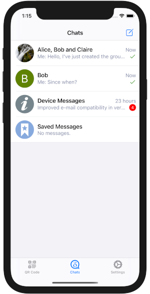
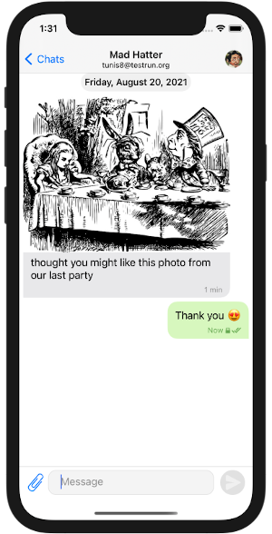
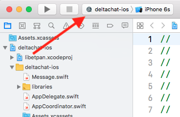
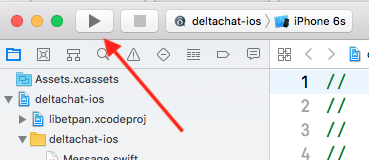

# deltachat-ios

Email-based instant messaging for iOS.

 


## Testing

Betas are distributed via Testflight. Just scan this QR code with the camera app of your iPhone/iPad


or open this link

https://testflight.apple.com/join/uEMc1NxS

on your iPhone or iPad to try Deltachat iOS Beta.

Check the Changelog (for TestFlight builds) at the bottom to see what's included.


## How to build with Xcode

### Install [rustup](https://rustup.rs)

```bash
curl --proto '=https' --tlsv1.2 -sSf https://sh.rustup.rs | sh
```

### Install [cargo-lipo](https://github.com/TimNN/cargo-lipo#installation)

```bash
cargo install cargo-lipo
```

### Setup workspace

```bash
git clone git@github.com:deltachat/deltachat-ios.git
cd deltachat-ios
git submodule update --init --recursive
# Make sure the correct rust version is installed
rustup toolchain install `cat rust-toolchain`
```

To run the project, open `deltachat-ios.xcworkspace` (**not** the 'xcodeproj' file).

```bash
open deltachat-ios.xcworkspace
```

This should open Xcode. Then make sure to select the *deltachat-ios* scheme at the top left (see screenshot below).



Now build and run - e.g. by pressing Cmd-r - or click on the triangle at the top:



If you're on MacOS Mojave and Xcode complains about missing header files (different mac versions may or may not install all headers),
you can force-install them with the following command:

```bash
$ sudo installer -pkg /Library/Developer/CommandLineTools/Packages/macOS_SDK_headers_for_macOS_10.14.pkg -target /
```

If you get an error about that file not existing, you probably simply don't have the Xcode command line tools installed which can be remedied simply as follows:

```bash
$ xcode-select --install
```

On MacOS Catalina the include paths changed, `/usr/include` doesn't exist anymore. 
You'll need to manually set the `CPATH` variable to specify the location of the header files:

```
export CPATH=/Applications/Xcode.app/Contents/Developer/Platforms/MacOSX.platform/Developer/SDKs/MacOSX.sdk/usr/include
```
Note: the default terminal switched to zsh on MacOS Catalina. All your exported variables have to move to ~/.zshrc


## Running the app on M1 Mac computers

If you want to import/export a backup this is the location you want to put it (import) or retrieve it (export)
```
~/Library/Containers/98CC2CD0-7DED-4E02-9C0A-B4FF287AA877/Data/Documents
```


## Accssing the Logs

Use the macOS Console app. (maybe some tool from libimobile device can also read the log)
Select your device (you need to plugin in your phone), then paste this in the seach field to only show messages from deltachat:
```
prozesspfad:deltachat-ios
```


These symbols are used and you can use them for filtering.
```
📡 - events
📡accountId - also events but replace accountId with the id you are interessted in
🚨📡 - error events
⚠️📡 - warn events
ℹ️📡 - info events
```